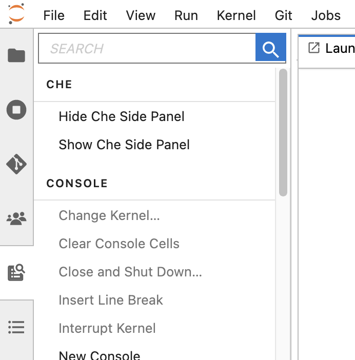
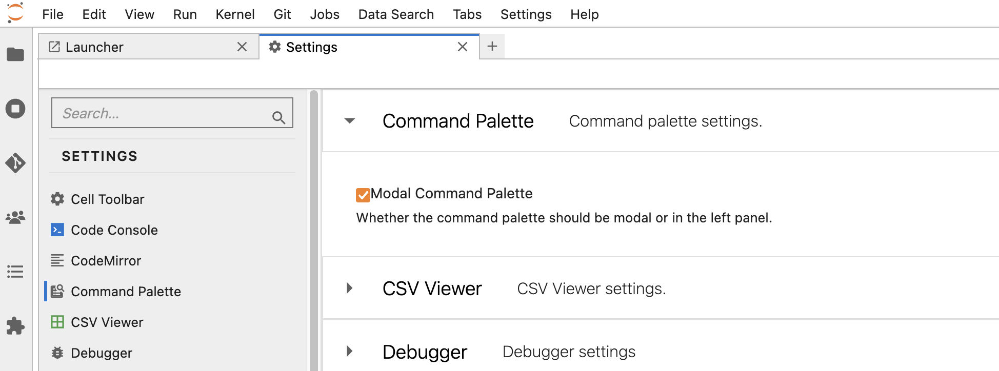

# MAAP Che sidebar visibility Jupyter extension

## Overview

A Jupyter extension that provides users the ability to hide the Eclipse Che sidebar in the MAAP ADE.

<br>

<br>
<br>

If the command pallete button is not visible in the left toolbar, toggling the "Modal Command Pallete" setting is needed. 

Menu -> Settings -> Advanced Settings -> Command Pallete - > Uncheck "Modal Command Pallete"

<br>

<br>
<br>

## Requirements

| Package | Version |
|---------|---------|
| JupyterLab | v4.1.6 |
| NodeJS | v18 |

These are the recommended versions. Others may be suitable, but are not actively supported.

## Install

To install the extension, execute:

```bash
pip install maap_che_sidebar_visibility_jupyter_extension
```

## Uninstall

To remove the extension, execute:

```bash
pip uninstall maap_che_sidebar_visibility_jupyter_extension
```

### Development install

Note: You will need NodeJS to build the extension package.

The `jlpm` command is JupyterLab's pinned version of
[yarn](https://yarnpkg.com/) that is installed with JupyterLab. You may use
`yarn` or `npm` in lieu of `jlpm` below.

```bash
# Clone the repo to your local environment
# Change directory to the che_sidebar_visibility_jupyter_extension directory
# Install dependencies
yarn install
# Install package in development mode
pip install -e "."
# Link your development version of the extension with JupyterLab
jupyter labextension develop . --overwrite
# Rebuild extension Typescript source after making changes
jlpm build
```

You can watch the source directory and run JupyterLab at the same time in different terminals to watch for changes in the extension's source and automatically rebuild the extension.

```bash
# Watch the source directory in one terminal, automatically rebuilding when needed
jlpm watch
# Run JupyterLab in another terminal
jupyter lab
```

With the watch command running, every saved change will immediately be built locally and available in your running JupyterLab. Refresh JupyterLab to load the change in your browser (you may need to wait several seconds for the extension to be rebuilt).

By default, the `jlpm build` command generates the source maps for this extension to make it easier to debug using the browser dev tools. To also generate source maps for the JupyterLab core extensions, you can run the following command:

```bash
jupyter lab build --minimize=False
```

### Development uninstall

```bash
pip uninstall maap_che_sidebar_visibility_jupyter_extension
```

In development mode, you will also need to remove the symlink created by `jupyter labextension develop`
command. To find its location, you can run `jupyter labextension list` to figure out where the `labextensions`
folder is located. Then you can remove the symlink named `maap-che-sidebar-visibility-jupyter-extension` within that folder.

## Release

See [RELEASE](RELEASE.md)

## Contribute

See [CONTRIBUTING](CONTRIBUTING.md)
